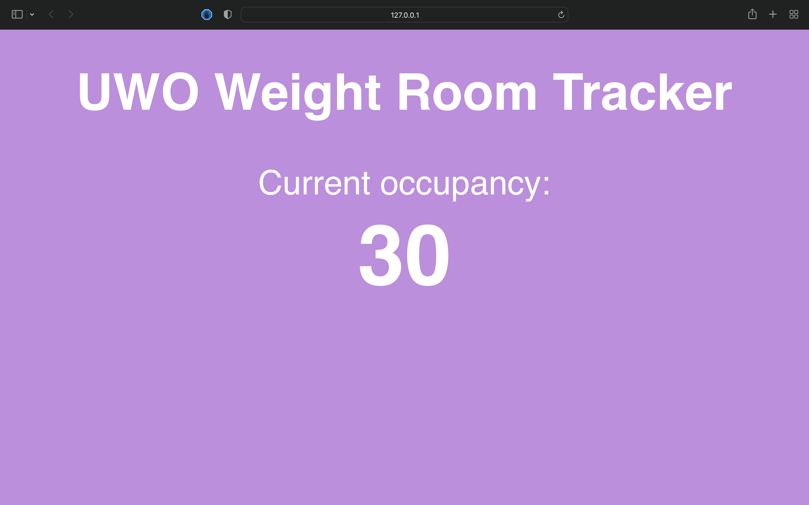
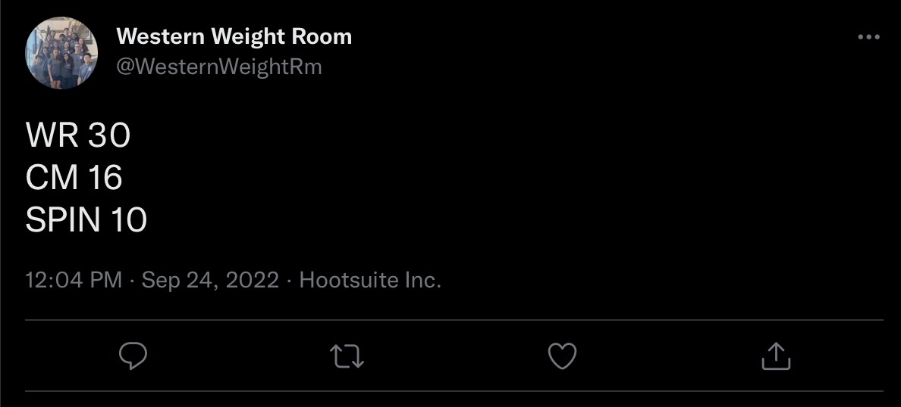

# UWO Weight Room Tracker
A Python web app that uses the Twitter API to fetch and display the current number of people using the weight room at Western University. Web app is created using Flask, and Tweets are obtained from the @WesternWeightRm Twitter account.
# How To Run
First, the proper Twitter API keys must be inserted into the "script.py" file. These keys can easily be obtained for personal use through https://developer.twitter.com for free.
With Python and all necessary libraries installed, run the "web.py" file to deploy the web app locally.
# Future Plans
I hope to get this web app properly hosted online in the future. Also, I intend to figure out how to get the data from the tweet no matter the formatting, as the script only works when the tweets are formatted in a specific way.
# Example Screenshots
## Web app in action:

## Tweet being used in this example:

